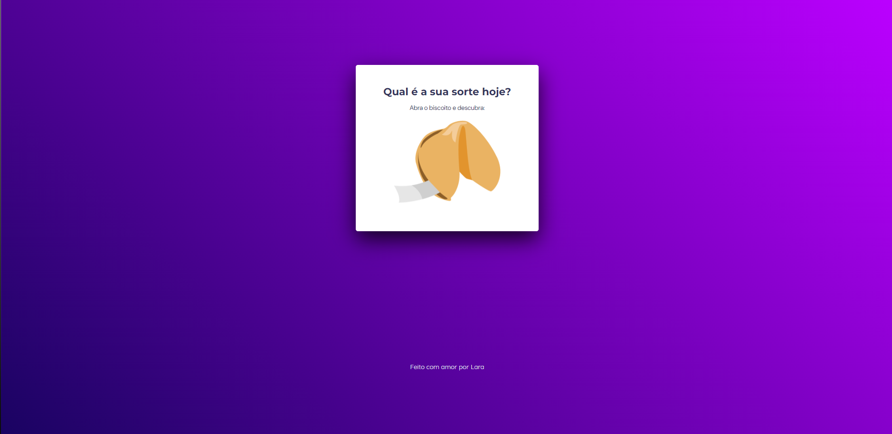

<h1 align="center">Lucky Cookie</h1>

It's a lucky coookie to open a beutiful phrase.  

  <a href="#-tecnologias">Techs/Tecnologias</a>&nbsp;&nbsp;&nbsp;|&nbsp;&nbsp;&nbsp;
  <a href="#-projeto">Project/Projeto</a>&nbsp;&nbsp;&nbsp;|&nbsp;&nbsp;&nbsp;
  <a href="#-layout">Layout</a>&nbsp;&nbsp;&nbsp;|&nbsp;&nbsp;&nbsp;
  <a href="#memo-licença">License/Licença</a>

  

  

## 🚀 Techs / Tecnologias

Esse projeto foi desenvolvido com as seguintes tecnologias:

- HTML e CSS
- JavaScript
- Git e Github

## 💻 Project / Projeto

A aplicação é um cookie animado baseado nos biscoitos chineses da sorte e todo dia você pode sortear frases motivacionais.

The application is an animated cookie based on Chinese fortune cookies and every day you can draw motivational phrases.

## 🔖 Layout

Você pode visualizar o layout do projeto através do repositório. 
